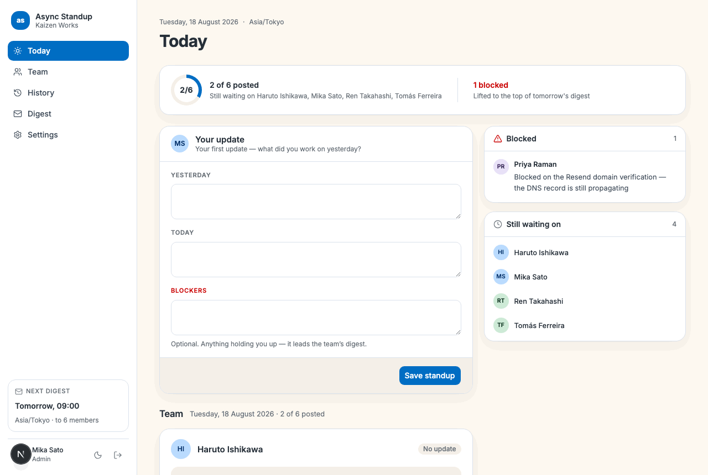
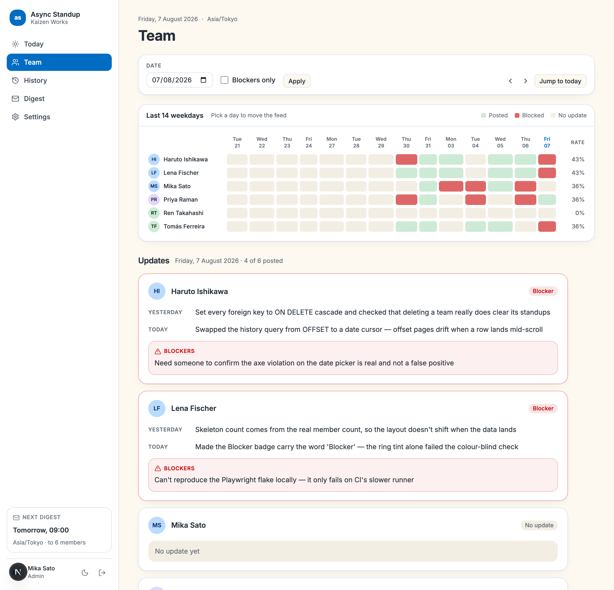
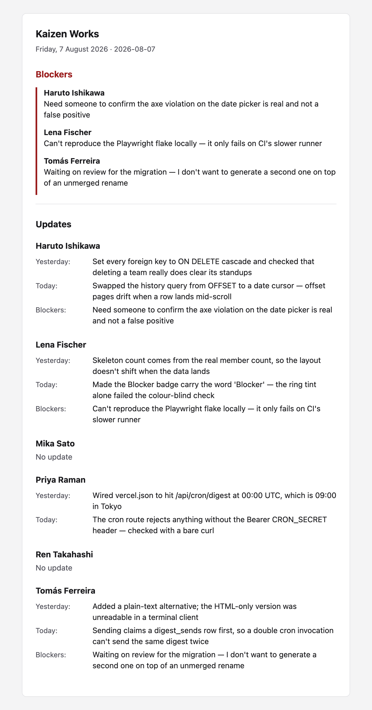
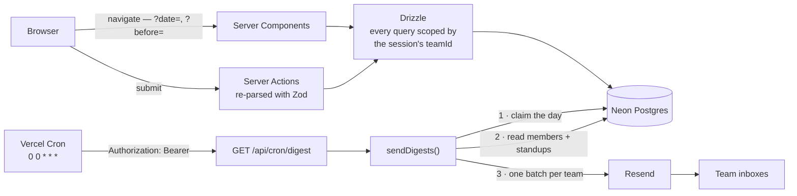

# Async Standup

[](https://github.com/febbryandika/async-standup/actions/workflows/ci.yml)
[](LICENSE)

**Async standup for distributed teams: post a daily update, get the team's digest by email each morning.**

**[Open the live demo →](https://async-standup-ten.vercel.app)** The login page has a
**Use demo account** button — one click signs you in as an admin of a seeded team with
two weeks of history, no signup and no password to copy.

> The demo team is shared and writable: anything you post is visible to the next
> visitor, and re-running the seed puts it back. Deliberately not wired to a nightly
> reset — the only scheduled job in this app is the digest.



<table>
<tr>
<td width="50%" valign="top">

**The team's day** — who posted, who is blocked, who is missing.



</td>
<td width="50%" valign="top">

**The email it becomes** — blockers first, everyone accounted for.



</td>
</tr>
</table>

## Features

- Post one update a day — yesterday, today, and anything blocking you — and rewrite it
  as often as you like while that day is still running.
- Every morning the whole team gets a single email: blockers lifted to the top, then
  everyone's update, with anyone who didn't post marked as such rather than omitted.
- Read back any past day on one page — a fortnight of who posted and who was blocked,
  above the updates themselves.
- Narrow a day down to just the blockers when that's all you need to know.
- Page back through your own updates as far as you have been posting.
- Start a team and share a six-character code; whoever has it joins. Admins can rotate
  the code if it leaks.

## Tech stack

| Layer      | Choice                                                |
| ---------- | ----------------------------------------------------- |
| Framework  | Next.js 16 (App Router) · React 19 · TypeScript       |
| UI         | Tailwind CSS v4 · shadcn/ui on Radix · light and dark |
| Data       | Neon Postgres · Drizzle ORM · drizzle-kit migrations  |
| Auth       | Better Auth, email and password                       |
| Mutations  | Server Actions, revalidated with Zod on the server    |
| Email      | Resend                                                |
| Scheduling | Vercel Cron                                           |
| Testing    | Vitest · Playwright · `@axe-core/playwright`          |
| Ops        | pnpm · Docker Compose · GitHub Actions · Vercel       |

**Why Next.js fullstack rather than a separate API server.** Every mutation here is a
form post from a signed-in member, and a Server Action already runs on the server with
the session in hand — so a REST tier would have been a second copy of the same auth
check and the same team scoping, reachable over the network and needing its own
protection. There are exactly two Route Handlers in the app, and both exist because
something outside the browser calls them.

**Why Vercel Cron rather than a worker process.** The schedule is one job, once a day.
A worker would mean a second deployable to keep alive, monitor and pay for, in exchange
for a timer — so the timer is Vercel's, the job is an ordinary Route Handler, and the
only thing guarding it is a bearer secret.

**Why Drizzle rather than Prisma.** The constraints _are_ the design in this project —
`UNIQUE(user_id, date)` is what makes a standup idempotent, `UNIQUE(team_id, date)` is
what makes the digest send once, `UNIQUE(user_id)` is what keeps every query one join
deep. Drizzle keeps them in the same TypeScript the queries are written in, with no
generate step between changing a table and seeing the type change.

## Architecture



No queue, no worker, no websockets, no client-side data layer. `/team` is server-rendered
from its search params, so the URL is the only state there is — shareable, and it works
with JavaScript off.

How the live deployment is put together, and how the cron was verified end to end
against it, is written up in [`docs/DEPLOYMENT.md`](docs/DEPLOYMENT.md).

## Running locally

```bash
cp .env.example .env      # its defaults match the Compose service below
docker compose up -d      # Postgres
pnpm i
pnpm db:reset             # migrate, then seed a demo team with two weeks of standups
pnpm dev                  # http://localhost:3000
```

Then sign in with **Use demo account**. The example file runs as-is for local
development — set `BETTER_AUTH_SECRET` (`openssl rand -base64 32`) before deploying
anywhere real, and `RESEND_API_KEY` only when you actually want mail sent, since
`/team/digest-preview` renders the same email without it.

If something already owns port 5432, set `DB_PORT` in `.env` and match it in
`DATABASE_URL`. `pnpm db:reset` drops, migrates and re-seeds — it is the one command
that fixes a local database in a bad state.

## Testing

`pnpm lint && pnpm typecheck && pnpm test` is what CI runs on every push, alongside a
second job that brings up Postgres for the database-backed and browser tests.

| Suite                                 | Covers                                                                                                                                                  |
| ------------------------------------- | ------------------------------------------------------------------------------------------------------------------------------------------------------- |
| `pnpm test` — 117 unit tests          | The pure logic worth being sure about: the digest builder, date handling across a UTC day boundary, the Zod schemas, the attendance grid, invite codes. |
| `pnpm test:integration` — 6 tests     | The things only a real database can answer: cursor pages never repeat or drop a row, and a second digest send for the same day is refused.              |
| `pnpm test:e2e` — 12 Playwright tests | Register → create a team → post → see it in the feed; editing replaces a card instead of adding one; a second user joins by code; the empty state.      |

Vitest is split into two projects, so a bare `vitest run` will try to start the
integration project and fail without a database — pass `--project unit` or use the
scripts above.

Accessibility is asserted, not assumed: `@axe-core/playwright` runs against `/` and
`/team` in both themes and fails the build on serious violations, and separate specs
walk the primary flow by keyboard and check the form is single-column at 375px. Blockers
are carried by the word "Blocker" in the badge — the colour is reinforcement, not the
signal.

## Engineering notes

**The date is derived on the server, never accepted from the client.**
`todayInTimezone(team.timezone)` is the only thing that produces a standup's `date`,
formatting through `Intl.DateTimeFormat('en-CA')` in the team's own zone. That removes a
whole class of timezone bug — a member in Berlin posting at 23:30 writes the team's
_today_, not their own — and it turns "editable only while it's still today" from a rule
someone has to enforce into a property of the code: a late edit simply writes today's
row, because a past date is never a target.

**The digest claims the day before it sends it.** `sendDigests()` inserts a
`digest_sends` row for `(team, date)` with `onConflictDoNothing().returning()` _first_;
zero rows back means another invocation already owns today and this one skips. A
"have we sent?" query followed by a branch would be a race between two overlapping cron
runs — a unique constraint is not. The row means the day was _handled_, not that mail
was delivered, which is a deliberate trade: with no retry, those are the same decision,
and the endpoint reports `{ sent, failed }` so a lost digest is at least visible.

**History pages by cursor, not offset.** `(user_id, date)` is unique and monotonic, so
`WHERE date < :before ORDER BY date DESC LIMIT 15` is both cheaper than an `OFFSET`
scan and stable when a row lands mid-read — offset paging silently repeats or skips a
row when the set shifts under it. The query fetches one row more than the page size to
answer "is there more?" without a second `COUNT`, and "Load older" is a plain link to
`?before=<cursor>`, so paging works with JavaScript off.

## What I'd build next

These were cut on purpose, not missed:

- **Slack or Discord delivery.** A second OAuth surface and a second renderer for the
  same content — real work, but nothing this project hasn't already shown.
- **Per-user digest times.** One daily cron is what the hosting gives; a per-team
  timezone is the honest version of "morning" that fits inside it. Per-user times need a
  scheduler, and a scheduler needs a worker.
- **Multiple teams per user.** `UNIQUE(user_id)` on `team_members` is load-bearing —
  it's why every query is one join deep and why no request ever carries a team id.
  Relaxing it touches every query in the app.
- **A real-time feed.** For a tool with a daily cadence, a page load is the correct
  refresh. Sockets would be latency nobody asked for.
- **Reminders, streaks and analytics.** Engagement mechanics for a tool whose entire job
  is to take five minutes a day.

## License

MIT — see [LICENSE](LICENSE).
